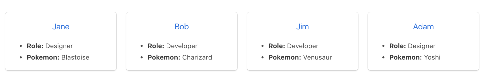

##### Tác giả: Adam Morgan
##### Link bài viết [Testing Angular with Jasmine and Karma (Part 1)](https://www.digitalocean.com/community/tutorials/testing-angular-with-jasmine-and-karma-part-1)
##### Ngày dịch: 28/10/2020

## Mục tiêu

Trong bài hướng dẫn này chúng ta sẽ xây dựng và kiểm thử một thư mục của nhân viên cho một công ty không có thật. Thư mục này sẽ hiển thị toàn bộ danh sách của người dùng cùng với một màn hình khác để xem thông tin cá nhân của những người dùng. Trong phần hướng dẫn này chúng ra sẽ tập trung xây dựng `service`, kiểm thử service này và sẽ sử dụng cho những người dùng.

Trong những phần hướng dẫn tiếp theo, chúng ta sẽ thêm vào trang hồ sơ người dùng với hình ảnh Pokemon yêu thích của người dùng sử dụng [Pokeapi](https://pokeapi.co/) và tìm hiểu thêm cách kiểm thử service cho HTTP request.

## Bạn nên biết điều gì

Trọng tâm chính của bài hướng dẫn này là kiểm thử các giả định của tôi mà bạn sẽ làm việc với TypeScript và ứng dụng Angular. Như mục tiêu của bài hướng dẫn này thì tôi sẽ không dành thời gian để giải thích service là gì và cách sử dụng của nó. Tôi sẽ cung cấp cho bạn code cũng như cách làm qua các phần kiểm thử của chúng ta.

## Tại sao phải Test ?

Từ kinh nghiệm cá nhân, kiểm thử là cách tốt nhất để ngăn chặn những khiếm khuyết của phần mềm. Tôi đã làm việc trong rất nhiều nhóm trong quá khứ, khi có những phần code được cập nhật và lập trình viên sẽ mở trình duyệt của họ hoặc Postman để kiểm tra xem các tính năng vẫn còn chạy không. Cách tiệp cần này (kiểm thử thủ công) là một thảm hoạ.

> Kiểm thử là cách tốt nhất để ngăn chặn những khiếm khuyết của phần mềm

Khi những tính năng và code tăng lên, kiểm thử thủ công sẽ trở nên tốn kém, tốn nhiều thời gian và dễ bị lỗi. Nếu một tính năng hoặc chức năng được gỡ bỏ thì liệu lập trình viên có nhớ hết tất cả những nơi mà nó được sử dụng hay không? Tất cả những lập trình trình viên có kiểm thử thủ công theo cùng một cách hay không ? Có lẻ là không.

Lý do mà chúng ta kiểm tra lại code là để xác nhận lại rằng nó vẫn hoạt động như chúng ta mong đợi hay không. Kết quả của quá trình này bạn sẽ tìm được cho bạn một tính năng tốt hơn và những lập trình viên khác cũng hỗ trợ thiết kế cho các API của bạn.

## Tại sao là Karma ?

Karma là một sản phẩm của nhóm AngularJS để cạnh tranh với những công cụ hiện có để kiểm thử những tính năng cho framework của chính họ. Như kết quả của nó, họ làm ra Karma và đã chuyển đổi nó tới Angular như một test runner mặc định khi tạo mới ứng dụng với Angular CLI.

Ngoài việc nó hoạt động tốt với Angular, nó cũng cung cấp một cách linh hoạt để điều chỉnh Karma phù hợp với quy trình làm việc của bạn. Nó bao gồm những tuỳ chọn để kiểm thử code của bạn trên nhiều trình duyệt và thiết bị như điện thoại, tablet, và thậm chí cả PS3 giống như Youtube.

Karma cũng cung cấp cho bạn tuỳ chọn để thay thế Jasmine với những framework kiểm thử khác như [Mocha](https://mochajs.org/) và [QUnit](https://qunitjs.com/) hoặc tích hợp với nhiều dịch vụ CI(Continuous integration) như [Jenkins](https://jenkins.io/), [TravisCI](https://travis-ci.org/) hoặc [CircleCI](https://circleci.com/).

Trừ khi bạn bổ sung thêm một số cấu hình nếu không thì thông thường cách tương tác với Karma sẽ được chạy với lệnh `ng test` trong của sổ terminal.

## Tại sao là Jasmine ?

Jasmine là một framework được phát triển để điều khiển hành vi phục vụ cho mục đính kiểm thử JavaScript code mà sẽ hoạt động tốt với Karma. Giống như Karma, nó cũng được khuyên sử dụng trong [tài liệu Angular](https://angular.io/guide/testing#setup) cũng như là cách cài đặt với Angular CLI. Jasmine cũng được cung cấp miễn phí và không yêu cầu DOM.

Tôi yêu Jasmine bởi vì hầu như tất cả những gì tôi cần đều đã được tích hợp. Một ví dụ đáng chú ý nhất là `spy`. `spy` trên một function cho phép bạn theo dõi những thuộc tính như là liệu nó có được goị hay không, gọi bao nhiêu lần, và với những đối số nào được gọi. Với framework như Mocha, `spy` sẽ không được tích hợp và phải kết hợp với một số thư việc khác như Sinon.js.

Một tin tốt là chi phí chuyển đổi giữa những framwork kiểm thử tương đối thấp với sự khác biệt nhỏ về cú pháp như Jasmine là `toEqual()` và Mocha là `to.equal()`.

## Một ví dụ kiểm thử đơn giản